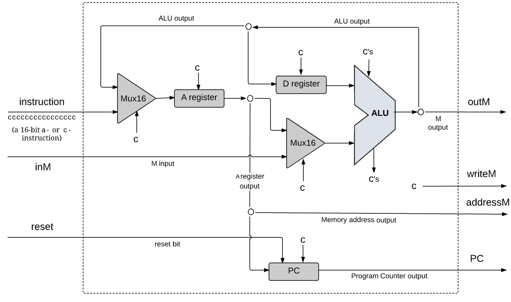
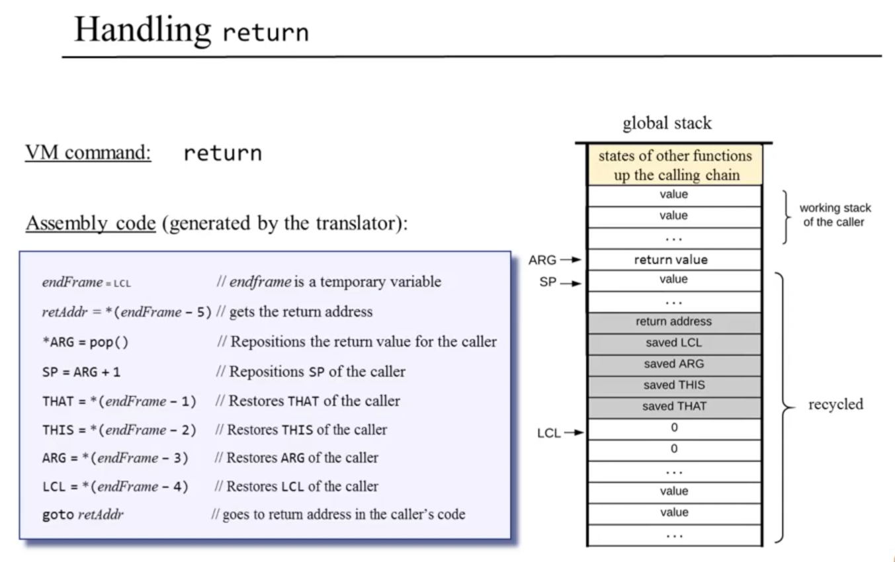
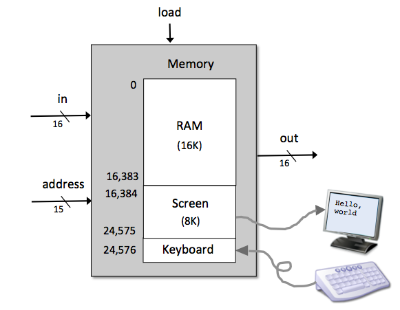
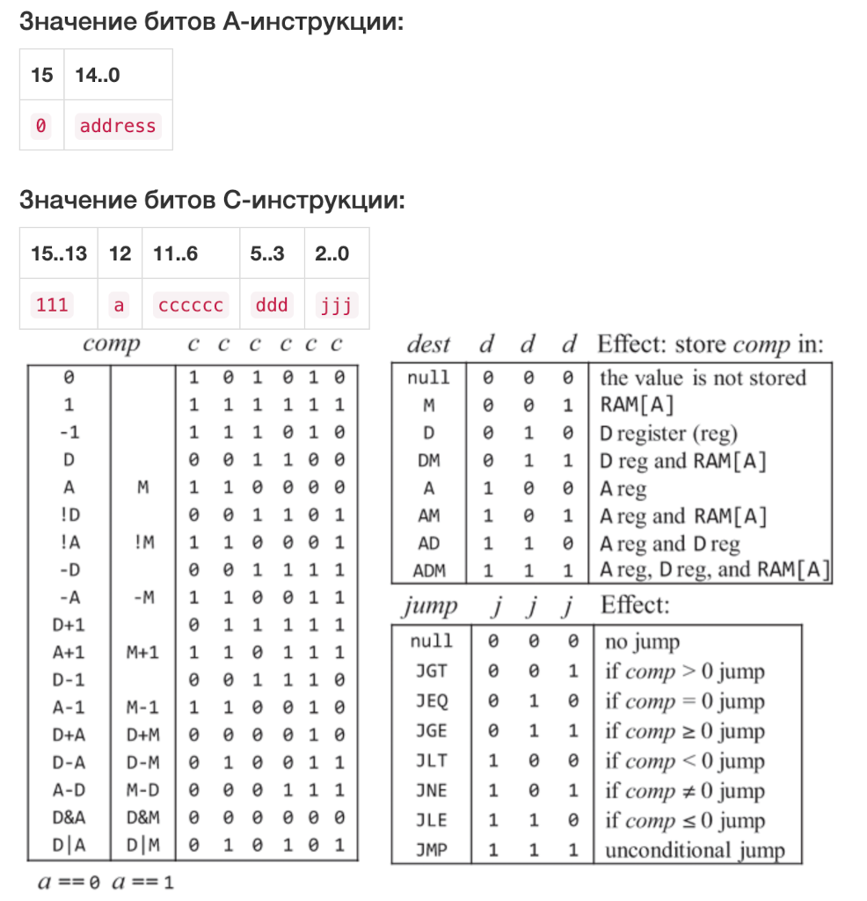
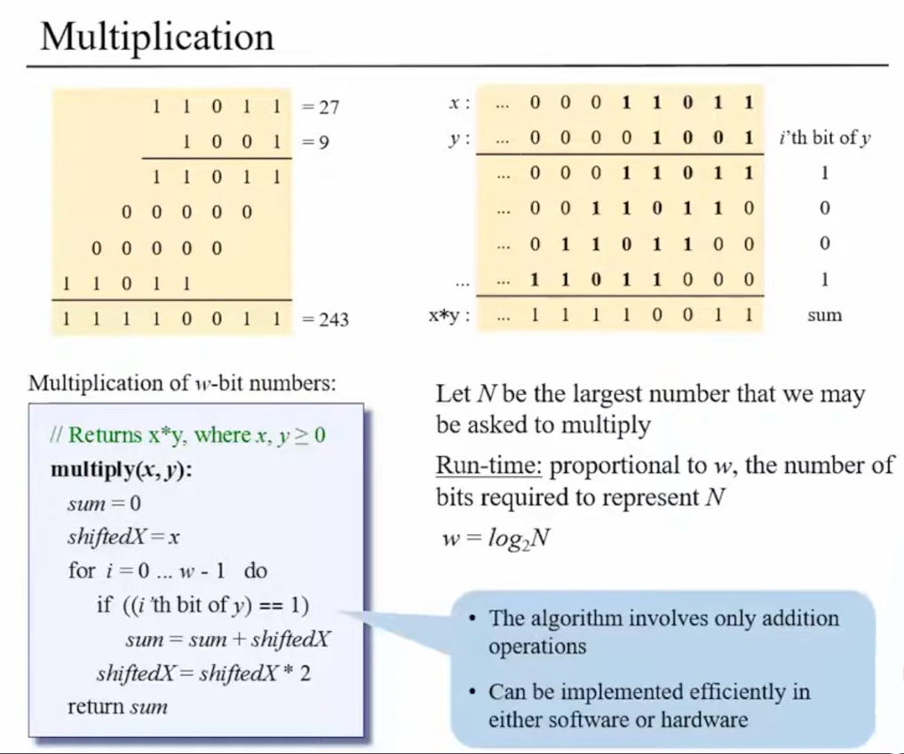
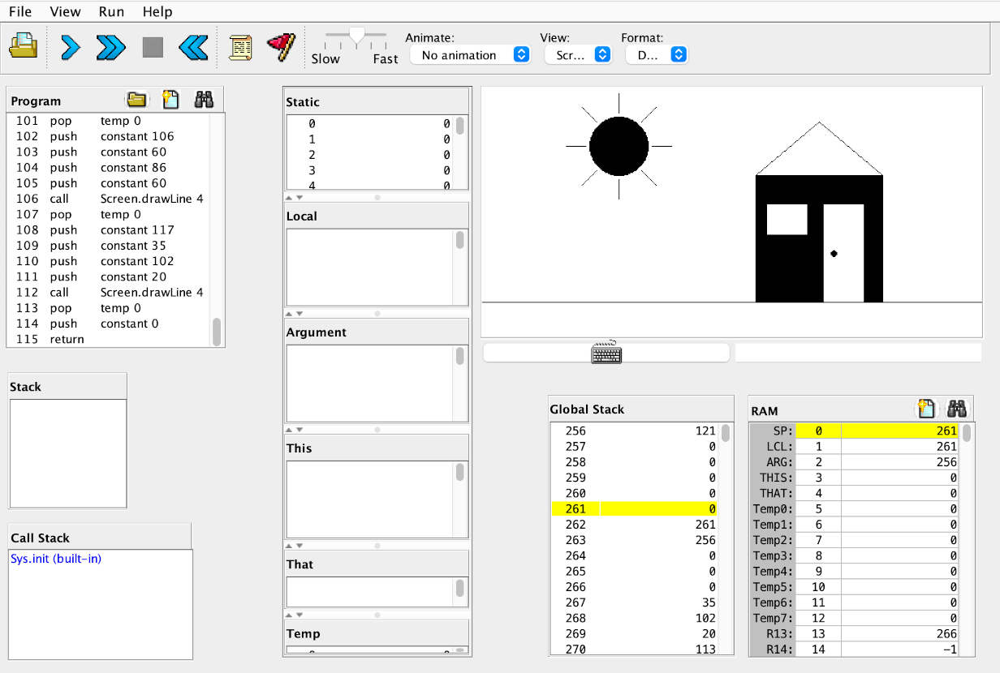
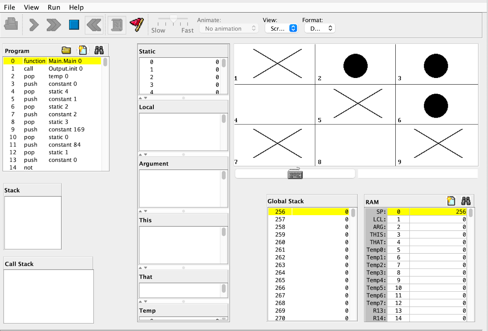

# nand-to-tetris

Решение задач с курса на ULearn

| | |
|-----|------|
|  | |
| Схема CPU | Обработка команды return виртуальной машиной |
|  |  |
| Память | Трансляция инструкции Hack |
|  |  |
| Умножение чисел | Эмулятор виртуальной машины |

## О курсе

Nand2Tetris - это курс про создание компьютера от логических вентилей до языка высокого уровня. Оригинальные лекций можно найти на [YouTube](https://youtube.com/@makkuzjaileron?si=b3S0YK70ys6kahve). Авторами предоставляется [software](https://www.nand2tetris.org/software) для решения заданий.

## Темы

<ol>
  <li> <a href="./01_BooleanLogic/">Булева логика.</a> Создание простых вентилей из nand </li>
  <li> <a href="./02_Arithmetic/">Арифметика и ALU.</a> Представление чисел. Операции с числами </li>
  <li> <a href="./03_Memory/">Сборка памяти а так же счетчиков.</a> </li>
  <li> <a href="./04_Hack/">Машинный язык.</a> Написание программ на Hack Assembly </li>
  <li> <a href="./05_Computer/">Сборка процессора и компьютера.</a> </li>
  <li> <a href="./06_Assembly/">Ассемблер Hack.</a> Трансляция ассемблера в машинный код </li>
  <li> <a href="./07_VMTranslator/">Виртуальная машина.</a> Трансляция VM-кода в язык ассемблерА </li>
  <li value="10"> <a href="./10_JackCompiler/">Компилятор Jack.</a> Создание компилятора: синтаксический разбор, токенизация и парсинг, генерация кода для виртуальной машины </li>
  <li value="12"> <a href="./12_JackOS/">Стандартная библиотека Jack.</a> Реализация стандартной библиотеки для языка высокого уровня </li>
</ol>

## Скрипты на bash

В папке [bash](./bash/):

### Logparser

Парсит ключи по которым была выполнена неуспешная попытка обновления лимита в рамках запроса по пути /api/news, закончившегося с кодом 418.

Пример:

```
2025-03-05 17:55:33,206 INFO [T-fc62740e-67ef-4527-aed1-478f5e110a64] Begin request: GET /api/news
2025-03-05 17:55:33,206 INFO [T-fc62740e-67ef-4527-aed1-478f5e110a64] [AuthHandler] Find permission for user dbba3869-d9c2-49ef-b7c7-c206af6c4b6f, path: news
2025-03-05 17:55:33,298 INFO [T-fc62740e-67ef-4527-aed1-478f5e110a64] [LimitRepository] Failed increment for: key=dbba3869-d9c2-49ef-b7c7-c206af6c4b6f.Standard.news
2025-03-05 17:55:33,314 INFO [T-fc62740e-67ef-4527-aed1-478f5e110a64] End request: 418, elapsed 289 ms [GET /api/news]
```

Будет найден ключ `dbba3869-d9c2-49ef-b7c7-c206af6c4b6f`:

<!-- ### Wikisearcher -->

## Игра крестики-нолики на Jack

[cross_and_zeroes](./crosses_and_zeroes/Main.jack) можно скомпилировать с помощью `JackCompiler` и запустить в эмуляторе `VMEmulator`, которые предоставляются в наборе [software](https://www.nand2tetris.org/software) для прохождения курса.


